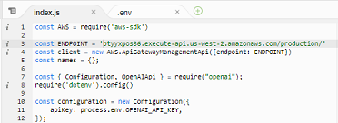

# Deploy de aplicação backend em AWS Lambda
<h2>Laboratório executado durante a AWS-Cloud-Week, na Dio.me</h2>

## Setup
### Sistema operacional: Windows 11 Pro
* Hardware: 
  * Processador: 11th Gen Intel(R) Core(TM) i3-1115G4 @ 3.00GHz   3.00 GHz
  * Ram: 8Gb
### Instalação do Node.js
* Versão utilizada: 17.7.1
* Fonte: https://nodejs.org/en/blog/release/v17.7.1/
* Arquivo:  https://nodejs.org/dist/v17.7.1/node-v17.7.1-x64.msi
* Para testar se foi instalado:
    > node -v 
    > v17.7.1
 ### Outros softwares e configurações:
 * Git (instalado, versão 2.37.0.windows.1);
 * Conta criada no GitHub;
 * Visual Studio Code (instalado, versão 1.75.1);
 * Configurar a integração do VSCode com o GitHub;
### AWS
* Usuário criado: silvia_cloud_week;
* Com acesso ao AWS Management Console;
* Marcado: "I want to create an IAM user";
* Senha gerada automaticamente;
* Usuário precisa criar nova senha no próximo login;
* Usuário criado sem nenhuma permissão;
* Importante! Fazer o download do arquivo csv (esta é a única chance!):
  

* Ao acessar com o endereço fornecido nesta tela (Console Sign-in URL), aparece uma tela para o login deste usuário:

* Conforme eu havia configurado, o console solicita a troca da senha no primeiro acesso:

* Porém, como não dei nenhuma permissão a esse usuário, não conseguirei acessar os recursos. 
* A tela abaixo mostra os avisos decorrentes da falta de permissão:

* Para corrigir, preciso entrar como root e adicionar permissões. Mesmo que o usuário silvia_cloud_week esteja logado, as permissões serão aplicadas imediatamente, bastando dar um refresh na página do console.

* O ideal é criar grupos e adicionar as permissões aos grupos. Daí, todos os usuários de um dado grupo terão as mesmas permissões de acesso. A aplicação das permissões também é imediata nesse caso.

<h4><b>Backend Serverless AWS</b></h4>

* Neste exercício são usados:
  * AWS Lambda:
    * Executa código em resposta a eventos;
    * Exemplos: chamada de API, upload de arquivo, atualização de BD;
    * Componentes principais: <b>eventos</b> (gatilho para execução), <b>funções</b> (código a executar), <b>recursos</b> (componentes usados pela função);
  * Amazon API Gateway

## A aplicação:
* Repositório: https://github.com/cassiano-dio/chatgpt-nodejs-api
* Neste exercício, o código será enviado para o AWS Lambda por um arquivo zip. Mas é possível integrar com um pipeline CI/CD, como o do GitHub, por exemplo. Também há serviços de CI/CD na AWS.
* A pasta da aplicação foi copiada para este repositório.

## Criando a função Lambda
* No console AWS buscar por Lambda e clicar em Create function;
* Clicar em "Author from scratch";
* Preencher: 
  * function name;
  * runtime: node.js 16;
  * architecture: x86_64;
  * execution role: create a new role with basic Lambda permissions;
  * clicar em Create function.

## API Gateway - criação do websocket
* No console AWS buscar API Gateway e selecionar Websocket, clicando em Build;
* Iniciar a configuração:
  

* Adicionar rotas padrão e customizadas:

  * As rotas precisam coincidir com o que está no código do index.js:
  

* Todos os métodos estão na mesma função Lambda, então todas as rotas serão integradas com ela:

* Dar um nome e clicar em Create and Deploy.
* Clicando em Stages > Production (que foi o nome que demos a ela), vê-se a URL do websocket:

* Copiar a URL do websocket e colar no código da função Lambda, no arquivo index.js:

* Clicar em Deploy.

## Configurar permissões no IAM:

* Ainda no console da função Lambda, clicar em Configuration > Permissions;
* Aparece o Role name que executa a função Lambda, clicar nele;
* Clicar em Add permissions > attach policies:

* Adicionar a política: AmazonAPIGatewayInvokeFullAccess

## Configurar o time out:
* Ainda no console da função Lambda, clicar em Configuration > General configuration;
* Alterar o time out para um minuto.

## Testar a aplicação sem o FrontEnd:
* Instalar a ferramenta wscat com 
  > npm i -g wscat
* Testar a conexão com a API com a URL do websocket:
  > wscat -c wss://btyyxpos36.execute-api.us-west-2.amazonaws.com/production

* Testar uma ação:
  > {"action":"setName","name":"Silvia"}

Resultado: 

